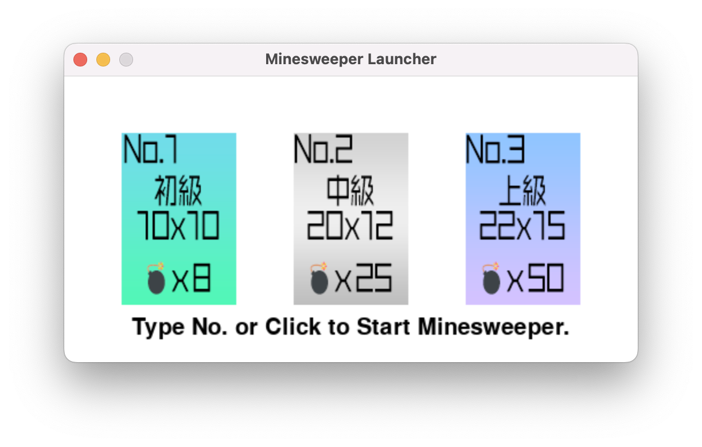
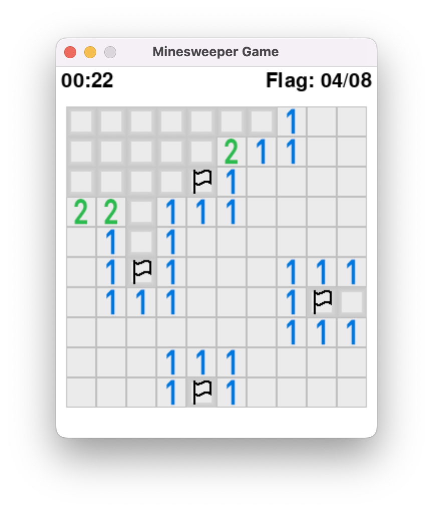
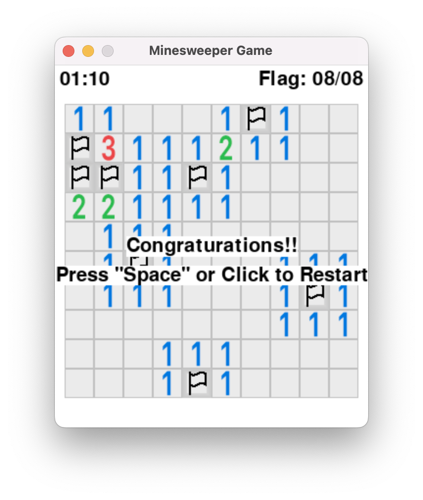

# About
Python3 で作成したマインスイーパのゲームです。
Pygame ライブラリを使用しています。

# Requirements
Pygame ライブラリがインストールされている必要があります。

Anaconda 環境の場合、`conda install pygame`コマンドでインストール可能です。

# How to run
`main.py`ファイルが実行用ファイルです。
`python main.py`のようにして実行します。

# How to play
通常のマインスイーパと同じで、マス目の数字は自分自身のマスの周り8マスに存在する爆弾の数を示しています。

右クリックで旗を立て、左クリックでマス目を開くことが可能です。

## 
- 爆弾のマスに全て旗を立てる
- 爆弾以外のマスを全て開く
以上を満たすとクリアとなります。

# Screenshots
トップ画面

プレイ中

クリア画面
